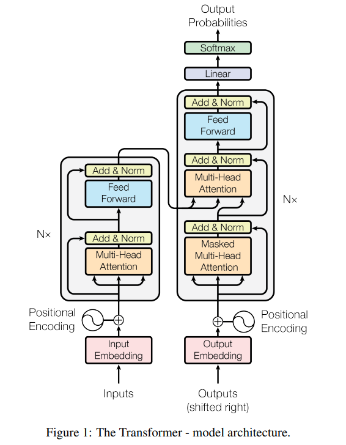
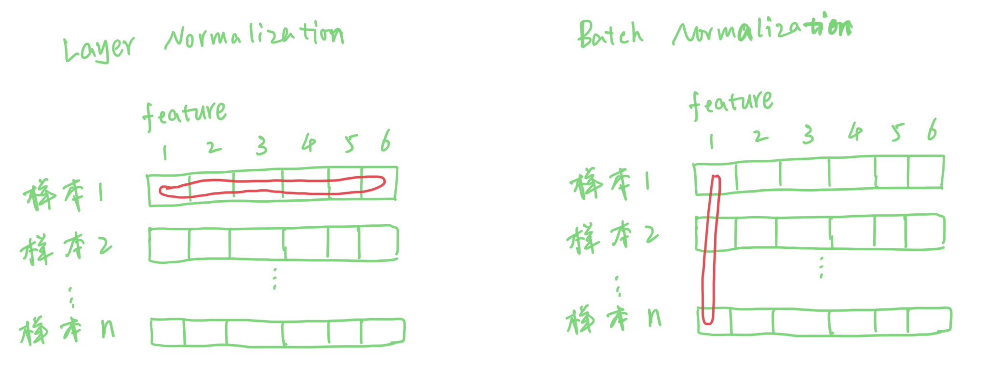
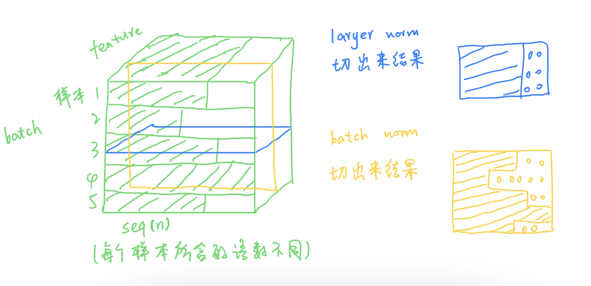
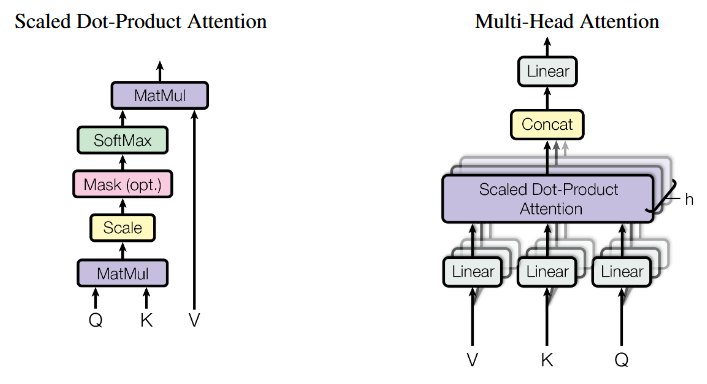
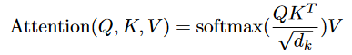
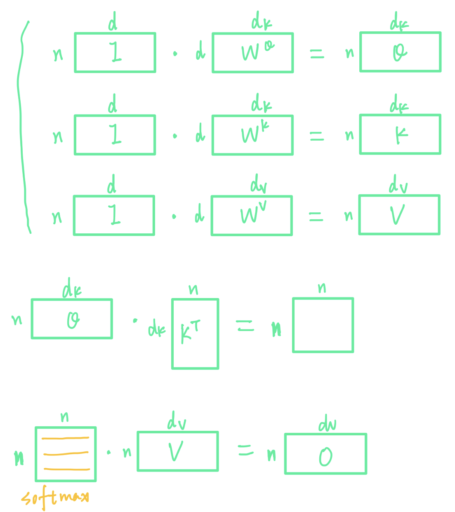
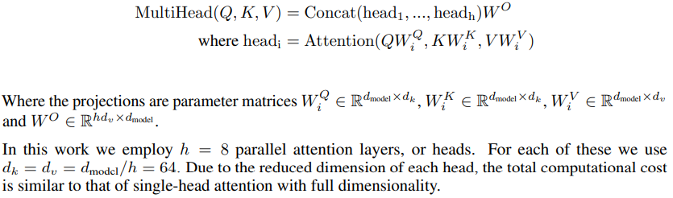
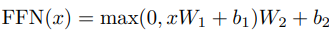
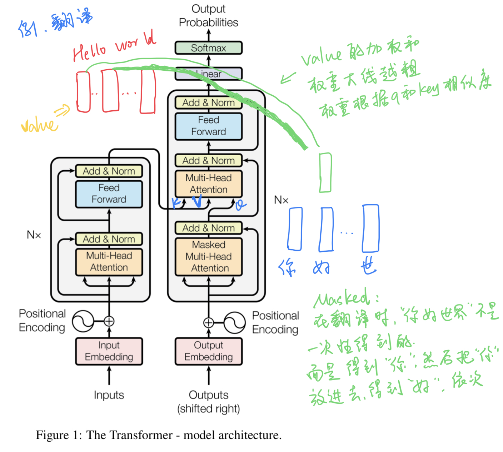

# Attention Is All You Need

## Introduction

### Motivation
- 主流的序列转换模型（机器翻译、语音识别等）都是基于复杂的编码解码的循环或卷积神经网络
- 存在顺序计算的约束，并行度低，计算效率低

### Contribution
- 提出了Transformer，网络结构简单，仅基于注意力机制，完全脱离了循环和卷积
- 实验表明在机器翻译任务上表现更好
- 并行度高，训练时间短

## Method-Transformer
### 1. Model Architecture：Encoder and Decoder Stacks

### 1.1 Encoder
- N=6 identical layers
- 2 sub-layers，residual connection and layer normalization around each of the 2 sub-layers
  - multi-head self-attention
  - feed-forward network

### 1.2 Decoder
- N=6 identical layers
- 3 sub-layers，residual connection and layer normalization around each of the 3 sub-layers
  - masked multi-head self-attention
  - multi-head self-attention
  - feed-forward network

注：  
- layer normalization 对一个样本的所有feature做normalization(在序列中不同样本的词数不一定相同，
例如：每句话词语数量不同)  
- batch normalization 对不同样本的相同feature做normalization

### 2. Attention

- An attention function can be described as mapping a query and a set of key-value pairs to an
output, where the query, keys, values, and output are all vectors. **The output is computed as a
weighted sum of the <u>values</u>, where the weight assigned to each value is computed by a
compatibility function of the <u>query</u> with the corresponding <u>key</u>.**

- query, key & value 的概念其实来源于推荐系统。基本原理是：给定一个 query，计算 query 与 key 的
相关性，然后根据query 与 key 的相关性去找到最合适的 value。举个例子：在电影推荐中。query 是某个
人对电影的喜好信息（比如兴趣点、年龄、性别等）、key 是电影的类型（喜剧、年代等）、value 就是待
推荐的电影。

### 2.1 Scaled Dot-Product Attention

- 向量内积体现相似性：向量的相似性由两者的角度余弦来度量，角度余弦值越大两者相似性越高。两个向量
模长固定的情形下，内积大小反映了两者相似性大小。

- 当dk比较大时，做点积可能会出现一些比较大或者比较小的值，它们之间的差距就会比较大，softmax时，值
大的就会很靠近1，值小的会很靠近0，梯度比较小，不利于收敛，所以除个 根号dk

### 2.2 Multi-Head Attention

## 3. Feed-Forward Networks
- 两个线性变换，中间有一个ReLU

## 4. Embedding
- 将一个词用一个n维向量表示，文中n=dmodel=512

## 5. Positional Encoding
- Attention没有利用sequence的位置信息，在Attention之前加入positional encoding

## 6. About Masked
- 在Scaled Dot-Product Attention中的mask
  - 例如Q乘K中，Q中的qt乘K时，只能乘K中的k1, k2, k3, ... kt-1, 不能乘kt及以后
  - 因为在t时不能看到t及以后的信息

- Decoder中的mask

## Experiment
- 机器翻译的实验，领域不相关，此处略